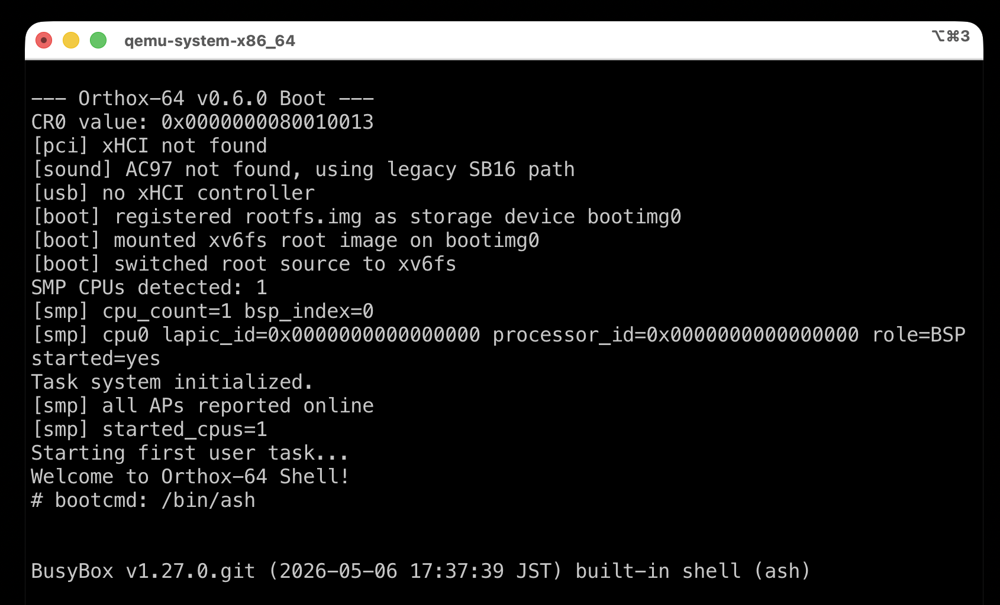
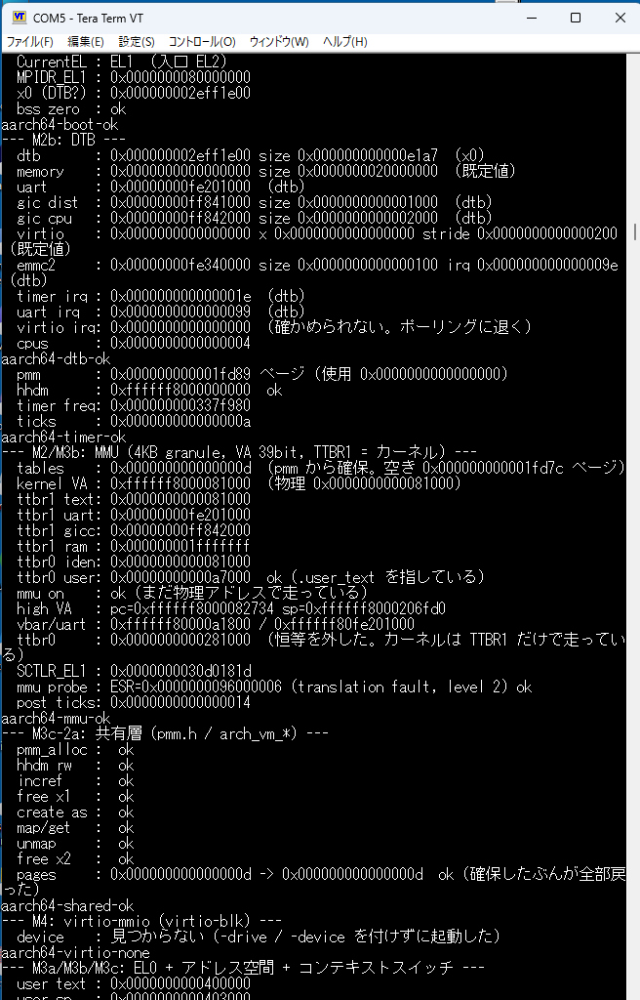

# Orthox-64 (development repository)

This is the **development snapshot** of Orthox-64. The book's reference implementation lives in a separate, frozen repository.

**Orthox-64 is a hobby x86-64 operating system that compiles its own kernel from within itself** — using a GCC toolchain ported to run natively on the OS — and boots a real userland: Python 3.12 with NumPy, BusyBox, a TCP/IP stack with HTTPS, and DOOM.

The running OS can rebuild its own kernel from source, and that kernel boots and runs — the **self-hosting loop** is closed.



Japanese main README: [README.md](README.md)

## Highlights

- **Self-hosting:** Compiles and boots its own kernel entirely within the running OS, using a natively-ported GCC 4.7.4 / Binutils 2.26 toolchain.
- **Dynamic userland:** Full dynamic linking via musl's dynamic linker — `.so` loading, `dlopen`/`dlsym`, TLS, C++ runtime support. Python 3.12 imports and runs NumPy 1.26.4.
- **Networking:** `virtio-net` + `lwIP` IPv4 stack (DHCP / DNS / ICMP / UDP / TCP / sockets), BusyBox `httpd`, and a BearSSL HTTPS client.
- **SMP:** 4-CPU bring-up in QEMU, LAPIC timer, per-CPU run queue, validated blocking-wakeup paths.
- **DOOM** (`doomgeneric`) runs.

## Quick Start

Reference host: **Ubuntu 24.04 (incl. WSL2)** or macOS. The host build uses `clang -target x86_64-elf` + `lld` — no separate cross GCC required.

```bash
# 1. Install build dependencies (Ubuntu 22.04 / 24.04 / WSL2)
sudo apt-get update
sudo apt-get install -y clang lld llvm build-essential make python3 \
  xorriso mtools qemu-system-x86 git

# 2. Build (produces orthos.iso)
make

# 3. Boot in QEMU (exit with Ctrl-A x)
make run
```

Full details, macOS instructions, and the on-OS GCC 4.7.4 toolchain build are in [INSTALL.md](INSTALL.md).

## Overview

- **Kernel:** 64-bit long mode, Limine boot, PMM/VMM paging, preemptive multitasking, SMP scheduler.
- **Filesystem:** VFS + read-write xv6fs (ported from xv6-riscv, triple-indirect blocks up to ~16 GB per file).
- **Ported:** musl 1.2.5 / BusyBox 1.27 / Binutils 2.26 / GCC 4.7.4 / Python 3.12.3 / NumPy 1.26.4 / doomgeneric.

## Raspberry Pi 4 (aarch64) Port

The kernel is being **ported to aarch64**. **On 15 August 2026 it booted on real Raspberry Pi 4 hardware for the first time.**



The MMU and user mode built up under QEMU ran on real hardware **without a single change.**

- **Boot:** entered at EL2 via armstub8, dropped to EL1 (raw binary loaded at `0x80000`).
- **DTB:** parses the `bcm2711-rpi-4-b.dtb` handed over by the firmware, taking the UART / GIC-400 / EMMC2 addresses and IRQs from the real machine.
- **MMU:** 4KB granule, 39-bit VA, kernel in TTBR1, running at high VA after dropping the identity map.
- **EL0:** user processes in two address spaces, recovery from permission faults, context switching, and the scheduler through timer wake-up.

**Not yet working:** SD card (EMMC2) initialisation, and reading the real RAM size.

See [`scripts/pi4/README.md`](scripts/pi4/README.md) for the procedure and the values measured on real hardware.

## License

Orthox-64 itself is released under the MIT License ([LICENSE](LICENSE)). The kernel includes filesystem code ported from xv6-riscv (MIT), and `ports/` bundles third-party components (musl, lwIP, BearSSL, Limine, CPython, zlib, BusyBox, GNU Make/Binutils/GCC). See [THIRD_PARTY_NOTICES.md](THIRD_PARTY_NOTICES.md).

## Acknowledgements

- **[MikanOS](https://github.com/uchan-nos/mikanos)** by [uchan-nos](https://github.com/uchan-nos): kernel architecture reference.
- **[Limine](https://github.com/limine-bootloader/limine)**: bootloader.
- **[xv6-riscv](https://github.com/mit-pdos/xv6-riscv)** (MIT PDOS, MIT): source of the ported root filesystem (xv6fs).
