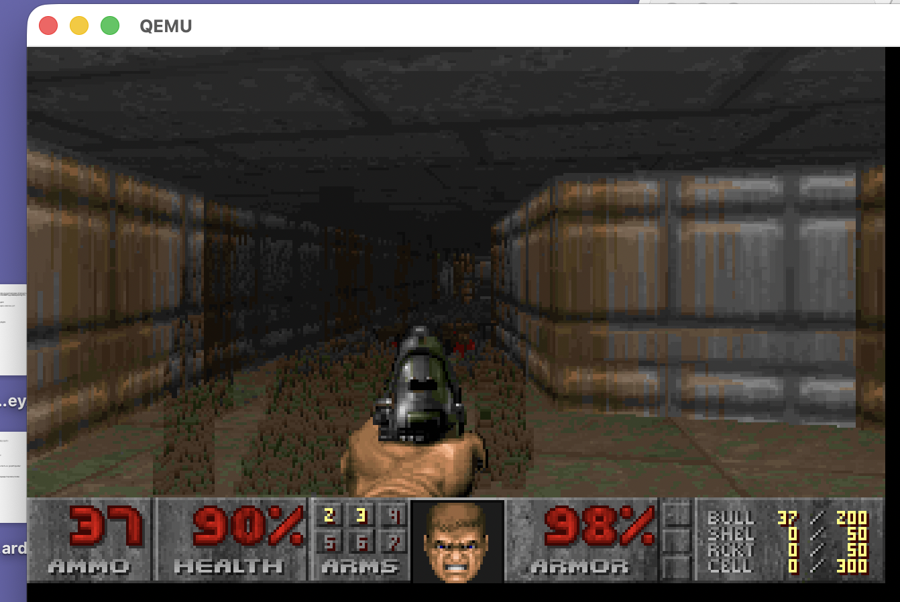

# Orthox-64

**Orthox-64 is a hobby x86-64 operating system that compiles its own kernel from within itself** — using a GCC toolchain ported to run natively on the OS — and boots a real userland: Python 3.12 with NumPy, BusyBox, a TCP/IP stack with HTTPS, and DOOM.

Most hobby kernels stop at a shell. Orthox-64 closes the **self-hosting loop**: the running OS can rebuild its own kernel from source, and that kernel boots and runs.




Japanese main README: [README.md](README.md)

## Highlights

- **Self-hosting (Day 43, 2026-05-03):** Orthox-64 compiles its own kernel from source *entirely within the running OS*, using a natively-ported GCC 4.7.4 / Binutils 2.26 toolchain. The resulting kernel boots and runs correctly — the self-hosting build loop is closed, and the OS builds itself.
- **A real dynamic userland:** Full dynamic linking via musl's dynamic linker — position-independent `.so` loading, `dlopen`/`dlsym`, TLS, and C++ runtime `.so` support. Python 3.12 imports and runs **NumPy 1.26.4** (verified: import, array addition, matrix multiplication, `sum`, `mean`).
- **Networking, end to end:** `virtio-net` + `lwIP` IPv4 stack with DHCP, DNS, ICMP, UDP, TCP, and socket syscalls — up to BusyBox `httpd` and a userspace **HTTPS** client (BearSSL).
- **SMP that actually schedules:** 4-CPU bring-up in QEMU, LAPIC timer, reschedule IPI, per-CPU run queue, and validated blocking-wakeup paths (pipe / `wait4()` / socket).
- **And yes, it runs DOOM** (`doomgeneric`).

## Quick Start

Reference host: **Ubuntu 24.04 (incl. WSL2)** or macOS. The host build uses `clang -target x86_64-elf` + `lld` — no separate cross GCC required.

```bash
# 1. Install build dependencies (Ubuntu 22.04 / 24.04 / WSL2)
sudo apt-get update
sudo apt-get install -y clang lld llvm build-essential make python3 \
  xorriso mtools qemu-system-x86 git

# 2. Clone
git clone https://github.com/itoh5588/Orthox-64.git
cd Orthox-64

# 3. Build kernel + userland + bootable ISO (produces orthos.iso)
make

# 4. Boot it in QEMU (serial console on stdio; exit with Ctrl-A x)
make run
```

Full details, macOS instructions, and the optional **on-OS GCC 4.7.4 toolchain** build (the one used for the self-hosted kernel build) are in [INSTALL.md](INSTALL.md).

## Concept and Design Philosophy

- **Etymology:** "Ortho-" comes from *orthodox*, combined with "-x" from the Unix tradition. Orthox-64 aims to be an orthodox, minimal Unix-like operating system.
- **Lightweight & Robust:** Orthox-64 rejects unnecessary system complexity and focuses on a small, stable kernel and userland substrate.
- **Pragmatic Unix Compatibility:** Rather than pursuing full POSIX compliance, it implements the minimum kernel and libc surface needed to run practical software such as BusyBox, GCC, and related toolchain components.
- **Integration over Reinvention:** Orthox-64 does not treat reimplementing every component from scratch as a virtue. Instead, it treats the integration and porting of high-quality existing open-source software as a primary engineering discipline.

## Why GCC 4.7.4?

A natural question for an osdev reader: why bootstrap with such an old compiler?

It was a deliberate choice. Early on, C++ wasn't needed for the system, so there was no reason to drag a C++ toolchain into the bootstrap — and **GCC 4.7.4 is the last GCC that builds with a C compiler alone** (GCC 4.8+ requires a working C++ toolchain to compile itself). That "no C++ yet" decision turned out to be the cleanest possible bootstrap path: a **C-only self-hosting loop first**. An older, lighter, C-only compiler is also far more forgiving to run on a young kernel whose memory manager and filesystem are still stabilizing — a modern GCC stresses those subsystems far harder. C++ runtime support (C++ `.so` loading, TLS) was added later, once the foundations were stable.

## Features

- **64-bit Long Mode:** Runs in full 64-bit mode.
- **Bootloader:** Uses [Limine](https://github.com/limine-bootloader/limine) for modern UEFI/BIOS booting.
- **Memory Management:** PMM (Physical Memory Manager) and VMM (Virtual Memory Manager) with paging.
- **Multitasking:** Preemptive multitasking, kernel threads, and an SMP-ready per-CPU scheduler base.
- **File System:** Virtual File System (VFS), read-write xv6fs-based root filesystem (ported from xv6-riscv, with triple-indirect block support for files up to ~16 GB), and tar-based initial ramdisk tooling for bring-up and fallback workflows.
- **USB Support:** Basic USB stack and Mass Storage Class (MSC) support.
- **Networking:** `virtio-net` + `lwIP` based IPv4 networking with DHCP, DNS, ICMP, UDP, TCP, socket syscalls, BusyBox `httpd`, outbound HTTP client support, and userland HTTPS client support with BearSSL.
- **SMP:** 4 CPU bring-up, LAPIC timer, reschedule IPI, per-CPU run queue, and validated blocking wakeup paths for pipe, wait, and socket workloads.
- **Sound:** PCM playback via AC97 with Sound Blaster 16 fallback, plus beep output.
- **Userland:** Environment based on `musl libc` for better standard compatibility.
- **Shared Libraries:** Full dynamic linking support — musl-based dynamic linker, position-independent `.so` loading, `dlopen`/`dlsym`, TLS (Thread-Local Storage), C++ runtime `.so` support, and Python C-extension `.so` imports.
- **Native Kernel Self-Compilation:** Orthox-64 can compile its own kernel from source, entirely within the running OS, using the natively-ported GCC 4.7.4 and Binutils 2.26. The resulting kernel boots and runs correctly — the self-hosting build loop is closed.
- **Ported Apps:** Capable of running ported software like `doomgeneric`, `Python 3.12`, and NumPy on Python.

## Ported Userland Components

- **musl libc:** `1.2.5`
- **BusyBox (`ash` and core applets):** `1.27.0.git`
- **GNU Binutils:** `2.26`
- **GCC:** `4.7.4`
- **Python:** `3.12.3`
- **NumPy:** `1.26.4` import and basic array operations validated on Orthox-64 through Python shared-object extension loading.
- **doomgeneric:** Vendored local port, upstream version not recorded in-tree

## Status

The project is currently in active development. Two major milestones have been reached:

**Shared Library Support:** Orthox-64 now supports full dynamic linking — musl's dynamic linker loads position-independent `.so` files, with `dlopen`/`dlsym`, TLS, C++ runtime support, and Python C-extension shared-object imports validated end-to-end. Python 3.12 can import and use NumPy 1.26.4 on Orthox-64; the smoke test covers NumPy import, array addition, matrix multiplication, `sum`, and `mean`.

**Native Kernel Self-Compilation (Day 43, 2026-05-03):** Orthox-64 can compile its own kernel from source entirely within the running OS, using the natively-ported GCC 4.7.4 toolchain. The resulting kernel boots and runs correctly. The self-hosting build loop is closed — the OS builds itself.

The SMP base is stable: Orthox-64 boots and runs on 4 CPUs in QEMU, uses a per-CPU run queue, and has validated pipe, `wait4()`, DNS, socket, UDP echo, BusyBox `httpd`, and userspace HTTPS paths under SMP. Current focus is on expanding userland compatibility and higher-level functionality on top of these foundations.

## Book

The design and implementation of Orthox-64 are documented in a full-length book that reads the OS from the system-call boundary inward — boot, memory, scheduling, fork/exec, VFS, musl, self-hosting, and a closing part on designing OS features with an AI agent.

- **Japanese edition:** [available on Amazon](https://www.amazon.co.jp/dp/B0H468KNCT)
- **English edition:** in progress.

## Acknowledgements

Orthox-64 is inspired by and references the following projects:

- **[MikanOS](https://github.com/uchan-nos/mikanos)**: A modern educational OS by [uchan-nos](https://github.com/uchan-nos). The kernel architecture and some primitive setups were developed with reference to its implementation.
- **[Limine](https://github.com/limine-bootloader/limine)**: Used as the bootloader for modern UEFI/BIOS support.
- **[xv6-riscv](https://github.com/mit-pdos/xv6-riscv)**: The xv6 teaching operating system by MIT PDOS, MIT License. Orthox-64's root filesystem (xv6fs) is ported from xv6-riscv's `kernel/fs.c`, `bio.c`, and `log.c`, extended with triple-indirect block support and adapted to the Orthox-64 kernel environment.

## License

Orthox-64 itself is released under the MIT License ([LICENSE](LICENSE)).

The kernel includes filesystem code ported from xv6-riscv (MIT), and the `ports/` directory bundles third-party components such as musl, lwIP, BearSSL, Limine, CPython, zlib, BusyBox, and GNU Make/Binutils/GCC. Their copyright notices and licenses (some under the GPL), along with distribution notes, are collected in [THIRD_PARTY_NOTICES.md](THIRD_PARTY_NOTICES.md).
